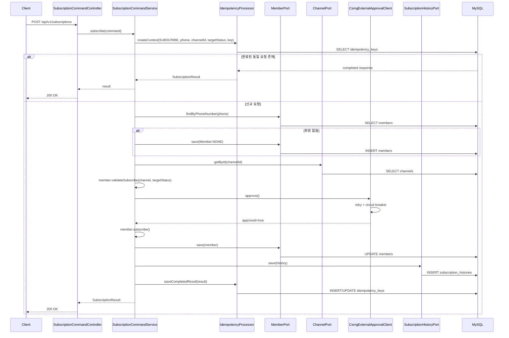
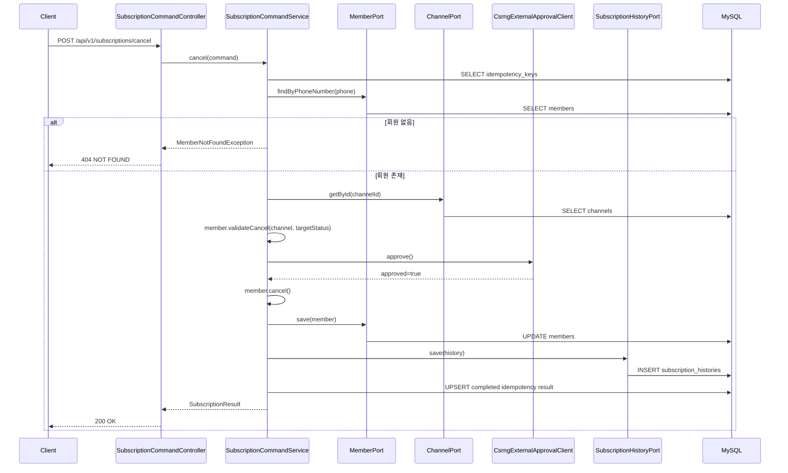
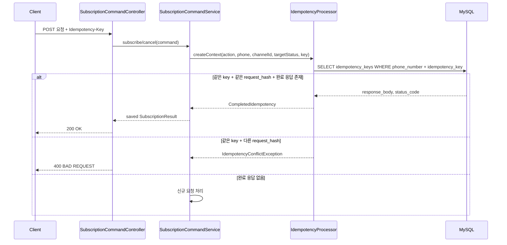
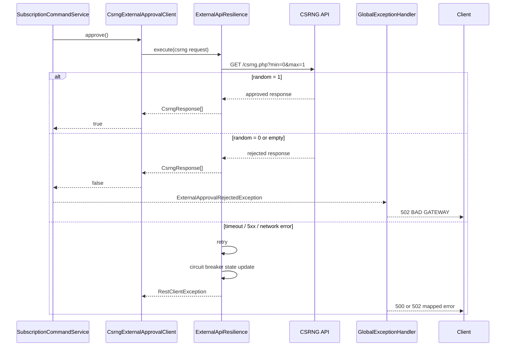
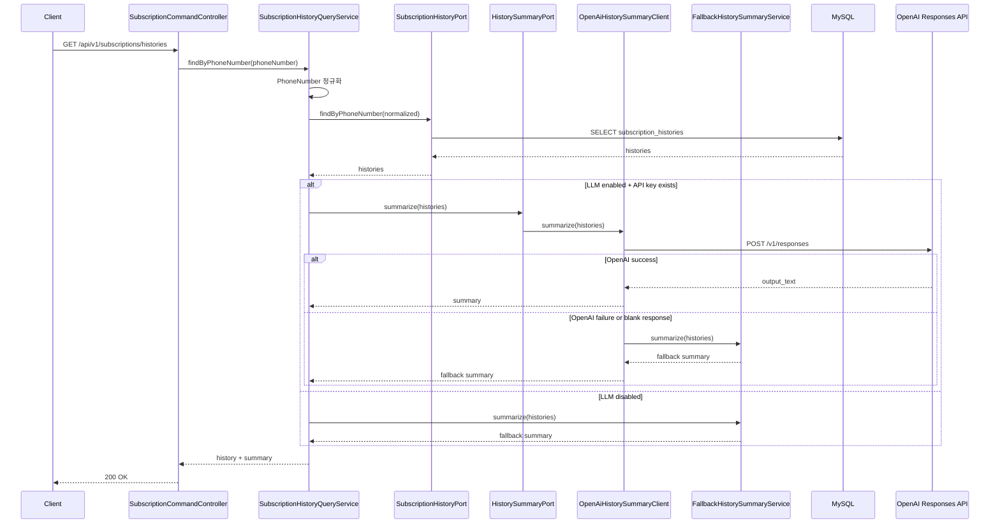
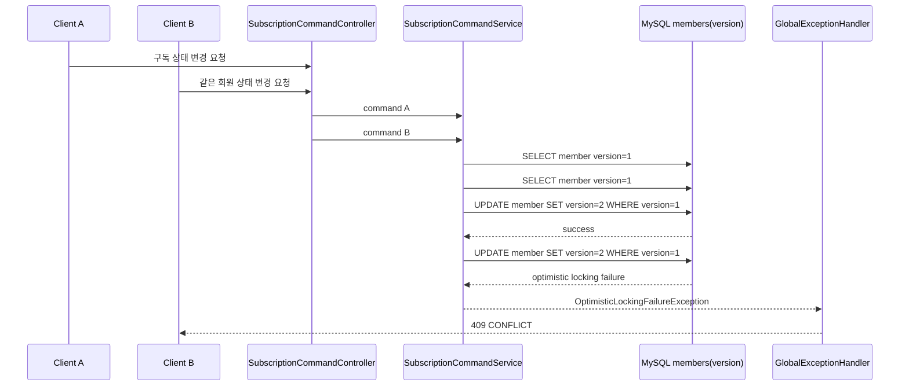

# 시퀀스 다이어그램

> ARTINUS Subscription API 주요 런타임 흐름

## 목차

- [구독 신청 성공](#구독-신청-성공)
- [구독 해지 성공](#구독-해지-성공)
- [멱등성 재요청](#멱등성-재요청)
- [외부 승인 거절 및 장애](#외부-승인-거절-및-장애)
- [구독 이력 조회 및 LLM 요약](#구독-이력-조회-및-llm-요약)
- [동시성 충돌](#동시성-충돌)

---

## 구독 신청 성공

핵심 포인트

- 멱등성 확인을 먼저 수행한다.
- 도메인 검증이 끝난 뒤 CSRNG 외부 승인 API를 호출한다.
- CSRNG 승인 이후 회원 상태, 이력, 멱등성 완료 결과를 하나의 트랜잭션 안에서 저장한다.

---

## 구독 해지 성공

핵심 포인트

- 해지는 기존 회원만 가능하다.
- 해지 가능 채널과 상태 전이 규칙을 모두 만족해야 한다.
- 콜센터, 이메일처럼 해지 전용 채널에서도 해지 처리가 가능하다.

---

## 멱등성 재요청

핵심 포인트

- 멱등성 기준은 `phone_number + idempotency_key`다.
- 요청 본문이 달라지면 같은 키라도 충돌로 처리한다.
- 외부 API 거절/장애처럼 성공하지 못한 요청은 완료 결과로 저장하지 않는다.

---

## 외부 승인 거절 및 장애

핵심 포인트

- `random=0`은 비즈니스 거절이므로 성공으로 보정하지 않는다.
- timeout, 5xx, 네트워크 오류는 retry와 circuit breaker 대상이다.
- 외부 승인 실패 시 DB 상태 변경과 이력 저장은 진행하지 않는다.

---

## 구독 이력 조회 및 LLM 요약

핵심 포인트

- LLM이 DB를 직접 조회하지 않는다.
- DB에서 조회한 이력 목록을 application 계층이 summary port로 전달한다.
- LLM 실패는 구독 이력 조회 API 실패로 전파하지 않는다.

---

## 동시성 충돌

핵심 포인트

- `members.version`은 JPA `@Version`으로 관리한다.
- 동시에 같은 회원 상태를 바꾸면 한 요청만 성공하고 나머지는 409로 응답한다.
- 클라이언트는 최신 상태를 다시 조회한 뒤 재시도해야 한다.
