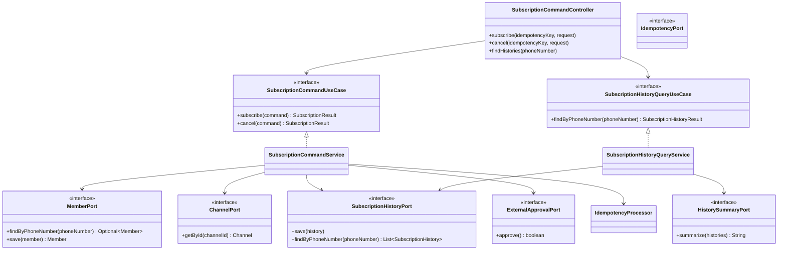
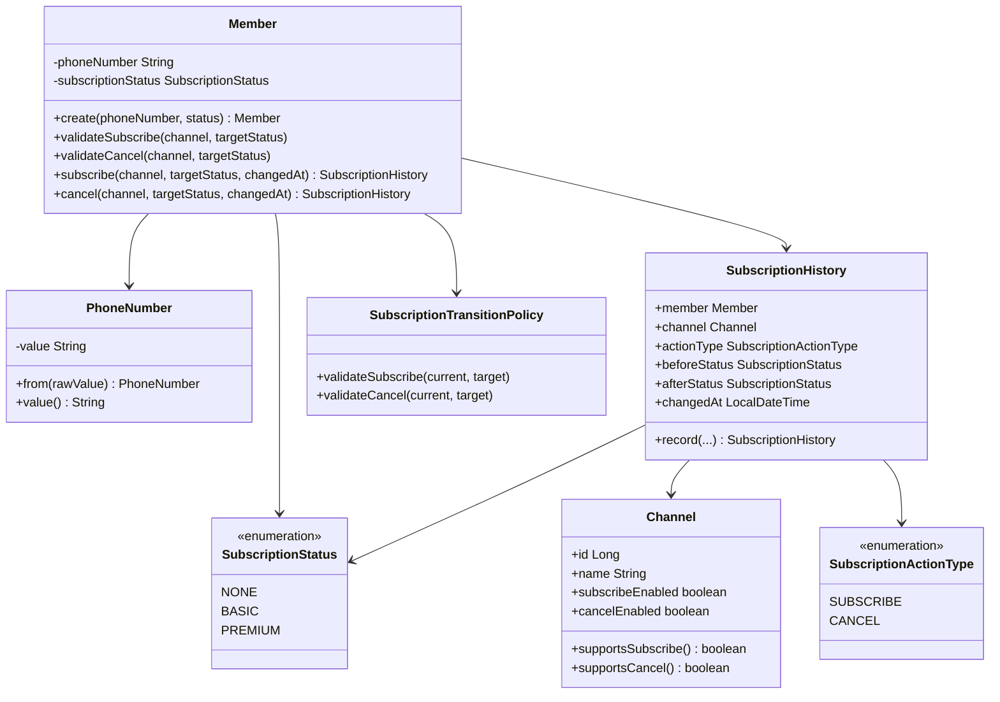
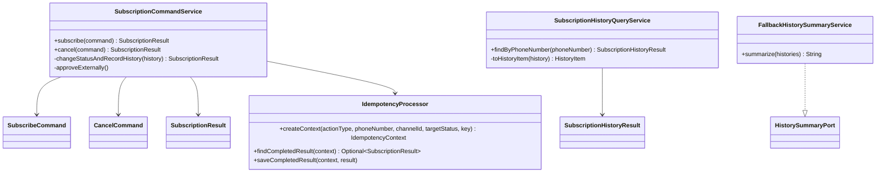
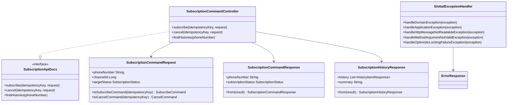

# 클래스 다이어그램

> ARTINUS Subscription API의 계층 구조와 핵심 클래스 관계

## 목차

- [레이어드 구조 (Hexagonal)](#레이어드-구조-hexagonal)
- [도메인 모델](#도메인-모델)
- [애플리케이션 서비스](#애플리케이션-서비스)
- [인프라 어댑터](#인프라-어댑터)
- [API 계층](#api-계층)
- [핵심 클래스 책임 요약](#핵심-클래스-책임-요약)

---

## 레이어드 구조 (Hexagonal)

---

## 도메인 모델

핵심 포인트

- `Member`가 구독/해지 상태 전이를 수행하고 이력을 생성한다.
- `Channel`은 구독/해지 가능 여부를 가진다.
- `SubscriptionTransitionPolicy`는 구독 상태 전이 규칙을 검증한다.
- `PhoneNumber`는 휴대폰번호 정규화와 검증을 담당한다.

---

## 애플리케이션 서비스

핵심 포인트

- application 계층은 port만 바라본다.
- CSRNG, JPA, OpenAI 같은 세부 구현은 infrastructure adapter에 둔다.
- fallback 요약은 외부 API 없이 application 계층에서 동작한다.

---

## 인프라 어댑터

```mermaid
classDiagram
    class JpaMemberAdapter {
      +findByPhoneNumber(phoneNumber) Optional~Member~
      +save(member) Member
    }

    class JpaChannelAdapter {
      +getById(channelId) Channel
    }

    class JpaSubscriptionHistoryAdapter {
      +save(history)
      +findByPhoneNumber(phoneNumber) List~SubscriptionHistory~
    }

    class JpaIdempotencyAdapter {
      +findCompleted(context) Optional~CompletedIdempotency~
      +saveCompleted(context, result)
    }

    class CsrngExternalApprovalClient {
      +approve() boolean
      -requestRandomResponses() CsrngResponse[]
    }

    class OpenAiHistorySummaryClient {
      +summarize(histories) String
      -fallback(histories) String
    }

    class ExternalApiResilience {
      +create(name) ExternalApiResilience
      +execute(supplier) T
    }

    JpaMemberAdapter ..|> MemberPort
    JpaChannelAdapter ..|> ChannelPort
    JpaSubscriptionHistoryAdapter ..|> SubscriptionHistoryPort
    JpaIdempotencyAdapter ..|> IdempotencyPort
    CsrngExternalApprovalClient ..|> ExternalApprovalPort
    OpenAiHistorySummaryClient ..|> HistorySummaryPort
    CsrngExternalApprovalClient --> ExternalApiResilience
    OpenAiHistorySummaryClient --> ExternalApiResilience
```

---

## API 계층

---

## 핵심 클래스 책임 요약

| 클래스 | 책임 |
|---|---|
| `Member` | 구독/해지 상태 전이와 이력 생성 |
| `SubscriptionTransitionPolicy` | 상태 전이 가능 여부 검증 |
| `SubscriptionCommandService` | 멱등성, 도메인 검증, 외부 승인, 저장 흐름 조율 |
| `SubscriptionHistoryQueryService` | 이력 조회와 요약 생성 조율 |
| `IdempotencyProcessor` | 요청 해시 생성, 완료 응답 재사용, 충돌 검증 |
| `CsrngExternalApprovalClient` | CSRNG 승인 API 호출 및 응답 판단 |
| `OpenAiHistorySummaryClient` | OpenAI 기반 이력 요약 및 fallback 연결 |
| `ExternalApiResilience` | 외부 API retry / circuit breaker 실행 래퍼 |
| `GlobalExceptionHandler` | 도메인/애플리케이션/validation/동시성 예외 응답 변환 |
