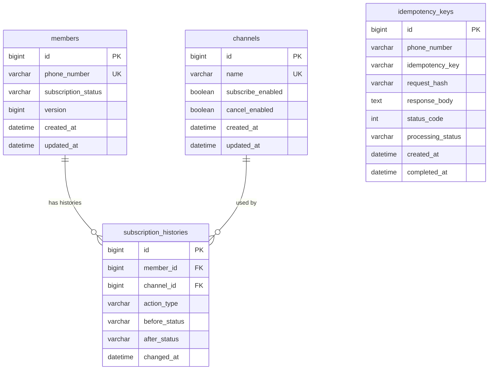

# ERD (Entity Relationship Diagram)

## 목차

- [메인 테이블 ERD](#메인-테이블-erd)
- [핵심 관계 설명](#핵심-관계-설명)
- [테이블 상세](#테이블-상세)
  - [members](#members)
  - [channels](#channels)
  - [subscription_histories](#subscription_histories)
  - [idempotency_keys](#idempotency_keys)
- [인덱스 전략](#인덱스-전략)
- [운영 관점 체크포인트](#운영-관점-체크포인트)

---

## 메인 테이블 ERD

---

## 핵심 관계 설명

- `members`는 휴대폰번호 기준으로 유일하다.
- `members.subscription_status`는 현재 구독 상태만 저장한다.
- `members.version`은 JPA `@Version` 기반 낙관적 락 컬럼이다.
- `channels`는 구독/해지 가능 여부를 가진 기준 테이블이다.
- `subscription_histories`는 회원의 상태 변경 이력을 append-only 형태로 저장한다.
- `subscription_histories.member_id`는 `members.id`를 참조한다.
- `subscription_histories.channel_id`는 `channels.id`를 참조한다.
- `idempotency_keys`는 물리 FK 없이 `phone_number + idempotency_key`로 요청 중복을 제어한다.

---

## 테이블 상세

### members

| 컬럼명 | 타입 | 제약조건 | 설명 |
|---|---|---|---|
| `id` | BIGINT | PK, AUTO_INCREMENT | 회원 식별자 |
| `phone_number` | VARCHAR(20) | NOT NULL, UNIQUE | 정규화된 휴대폰번호 |
| `subscription_status` | VARCHAR(20) | NOT NULL | `NONE`, `BASIC`, `PREMIUM` |
| `version` | BIGINT | NOT NULL | 낙관적 락 버전 |
| `created_at` | DATETIME(6) | NOT NULL | 생성 시각 |
| `updated_at` | DATETIME(6) | NOT NULL | 수정 시각 |

인덱스

- `uk_members_phone_number`: `(phone_number)` unique

### channels

| 컬럼명 | 타입 | 제약조건 | 설명 |
|---|---|---|---|
| `id` | BIGINT | PK, AUTO_INCREMENT | 채널 식별자 |
| `name` | VARCHAR(50) | NOT NULL, UNIQUE | 채널명 |
| `subscribe_enabled` | BOOLEAN | NOT NULL | 구독 가능 여부 |
| `cancel_enabled` | BOOLEAN | NOT NULL | 해지 가능 여부 |
| `created_at` | DATETIME(6) | NOT NULL | 생성 시각 |
| `updated_at` | DATETIME(6) | NOT NULL | 수정 시각 |

Seed data

| id | name | subscribe_enabled | cancel_enabled |
|---:|---|---|---|
| 1 | 홈페이지 | true | true |
| 2 | 모바일앱 | true | true |
| 3 | 네이버 | true | false |
| 4 | SKT | true | false |
| 5 | 콜센터 | false | true |
| 6 | 이메일 | false | true |

### subscription_histories

| 컬럼명 | 타입 | 제약조건 | 설명 |
|---|---|---|---|
| `id` | BIGINT | PK, AUTO_INCREMENT | 이력 식별자 |
| `member_id` | BIGINT | NOT NULL, FK | 회원 ID |
| `channel_id` | BIGINT | NOT NULL, FK | 채널 ID |
| `action_type` | VARCHAR(20) | NOT NULL | `SUBSCRIBE`, `CANCEL` |
| `before_status` | VARCHAR(20) | NOT NULL | 변경 전 상태 |
| `after_status` | VARCHAR(20) | NOT NULL | 변경 후 상태 |
| `changed_at` | DATETIME(6) | NOT NULL | 변경 시각 |

인덱스

- `idx_histories_member_changed_at`: `(member_id, changed_at)`

### idempotency_keys

| 컬럼명 | 타입 | 제약조건 | 설명 |
|---|---|---|---|
| `id` | BIGINT | PK, AUTO_INCREMENT | 멱등성 레코드 식별자 |
| `phone_number` | VARCHAR(20) | NOT NULL | 요청 회원 휴대폰번호 |
| `idempotency_key` | VARCHAR(100) | NOT NULL | 클라이언트가 전달한 멱등성 키 |
| `request_hash` | VARCHAR(128) | NOT NULL | action, phone, channel, targetStatus 기반 요청 해시 |
| `response_body` | TEXT | NULL | 완료 응답 JSON |
| `status_code` | INT | NULL | 완료 응답 HTTP 상태 |
| `processing_status` | VARCHAR(20) | NOT NULL | 처리 상태 |
| `created_at` | DATETIME(6) | NOT NULL | 생성 시각 |
| `completed_at` | DATETIME(6) | NULL | 완료 시각 |

인덱스

- `uk_idempotency_phone_key`: `(phone_number, idempotency_key)` unique
- `idx_idempotency_created_at`: `(created_at)`

---

## 인덱스 전략

| 인덱스 | 목적 |
|---|---|
| `uk_members_phone_number` | 회원 조회 및 중복 회원 방지 |
| `uk_channels_name` | 채널명 중복 방지 |
| `idx_histories_member_changed_at` | 회원별 구독 이력 조회 |
| `uk_idempotency_phone_key` | 같은 회원의 같은 멱등성 키 중복 방지 |
| `idx_idempotency_created_at` | 향후 만료 데이터 정리 배치 조회 |

---

## 운영 관점 체크포인트

- 회원 상태 동시 변경은 `members.version`으로 충돌을 감지한다.
- 구독 이력은 현재 append-only이며 soft delete를 사용하지 않는다.
- `idempotency_keys`는 향후 TTL 정책이나 스케줄러로 만료 데이터를 정리할 수 있다.
- `subscription_histories`는 운영 보관 정책이 확정되면 archive table 또는 외부 storage 이관을 고려한다.
- 현재 요구사항에서는 Redis를 도입하지 않는다. 멱등성과 동시성은 MySQL unique constraint와 optimistic locking으로 처리한다.
